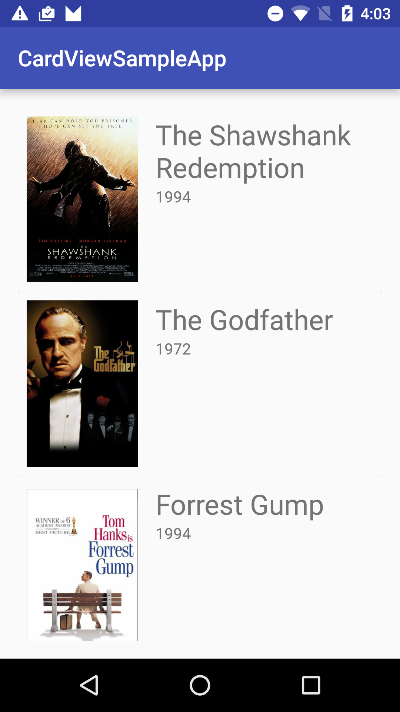

# CardViewSampleApp

This project is a sample app for using CardView within RecyclerView.

When I started to implement my own project I was surprised that I couldn't find even one sample project for how to use CardView in an app. 

This project follows the official guidelines from the official Android Developers page:
https://developer.android.com/training/material/lists-cards.html

And also used the some of the code in this guide:

http://code.tutsplus.com/tutorials/getting-started-with-recyclerview-and-cardview-on-android--cms-23465

